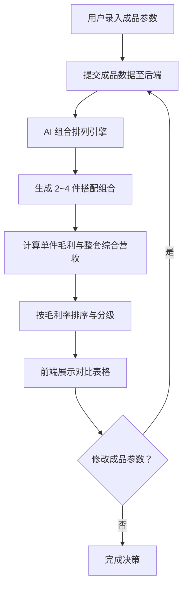

## 1. 产品概述

手作店多类成品组合售卖毛利测算工具，面向手作店经营者和采购决策人员，通过录入各类手作成品的单件成本与零售定价，AI 自动排列出十余种搭配售卖组合，分别计算每套组合的单件毛利与整套综合营收，帮助经营者快速识别高利润搭配与低利润搭配方案，优化售卖策略。

- 解决手作店组合售卖时毛利计算繁琐、搭配方案缺乏数据支撑的问题
- 目标用户：手作店经营者、店长、采购决策人员，核心价值为数据驱动的组合售卖决策

## 2. 核心功能

### 2.1 用户角色

| 角色 | 使用方式 | 核心权限 |
|------|----------|----------|
| 店铺经营者 | 直接访问页面 | 录入成品参数、查看组合方案、调整参数实时重算 |

### 2.2 功能模块

1. **成品参数配置页**：手作成品录入（名称、分类、成本、售价）、参数实时编辑、分类筛选
2. **组合收益推演页**：AI 组合排列展示、单件毛利与整套综合营收对比表格、高/低利润方案区分标识

### 2.3 页面详情

| 页面名称 | 模块名称 | 功能描述 |
|----------|----------|----------|
| 成品参数配置页 | 成品录入表单 | 依次录入陶艺、香薰、石膏娃娃等成品的单件成本与零售定价，支持增删改 |
| 成品参数配置页 | 成品列表 | 按分类展示已录入成品，支持行内编辑成本与售价参数 |
| 组合收益推演页 | 组合方案表格 | AI 自动排列十余种搭配组合，展示每套组合的单件毛利、整套综合营收、毛利率 |
| 组合收益推演页 | 利润等级标识 | 用颜色/标签清晰区分高利润搭配（绿色）与低利润搭配（红色），支持按利润率排序 |
| 组合收益推演页 | 实时刷新 | 修改任意成品参数后，后端立即重新运算全部组合收益数据并刷新页面 |

## 3. 核心流程

用户进入页面后，首先在成品参数配置区域录入各类手作成品的成本和售价信息。提交后，后端 AI 引擎自动基于所有成品生成十余种搭配组合方案（2~4件组合），计算每套组合中各单品的毛利、整套综合营收及毛利率。结果以对比表格形式展示，高利润方案绿色高亮、低利润方案红色标识。用户可随时修改任意成品的成本或售价，系统实时重新计算并刷新所有组合数据。

## 4. 用户界面设计

### 4.1 设计风格

- 主色调：温暖陶土色系（#C4956A）搭配深棕背景（#2C1810），呼应手作陶艺质感
- 辅助色：奶油白（#F5EDE0）作为卡片背景，翠绿（#4CAF50）标识高利润，珊瑚红（#E57373）标识低利润
- 按钮风格：圆角胶囊按钮，带微妙阴影，hover 时轻微上浮
- 字体：标题使用 "Playfair Display"（衬线字体，手工质感），正文使用 "Noto Sans SC"
- 布局风格：左右分栏布局，左侧参数配置面板，右侧组合收益推演表格
- 图标风格：lucide-react 线性图标，搭配圆角容器

### 4.2 页面设计概览

| 页面名称 | 模块名称 | UI 元素 |
|----------|----------|---------|
| 成品参数配置页 | 成品录入表单 | 卡片式表单，输入框带标签，下拉选择分类，添加按钮 |
| 成品参数配置页 | 成品列表 | 表格行内编辑，分类标签色块，删除确认弹窗 |
| 组合收益推演页 | 组合方案表格 | 宽幅数据表格，列：组合名称、包含成品、单件毛利明细、整套综合营收、毛利率，行背景色按利润等级渐变 |
| 组合收益推演页 | 利润等级标识 | 左侧色条标识（绿/红），毛利率数字颜色编码 |
| 组合收益推演页 | 实时刷新指示 | 参数变更时顶部进度条动画 + 表格数据淡入更新 |

### 4.3 响应式设计

- 桌面优先设计，左右分栏在大屏（≥1280px）完整展示
- 平板端（768px~1279px）切换为上下布局
- 移动端（<768px）单列堆叠，表格支持横向滚动

### 4.4 3D 场景引导

不适用，本工具为纯数据展示型应用，无需 3D 场景。
