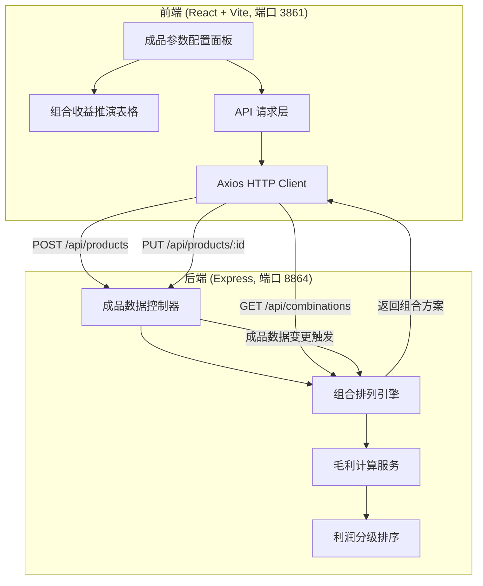
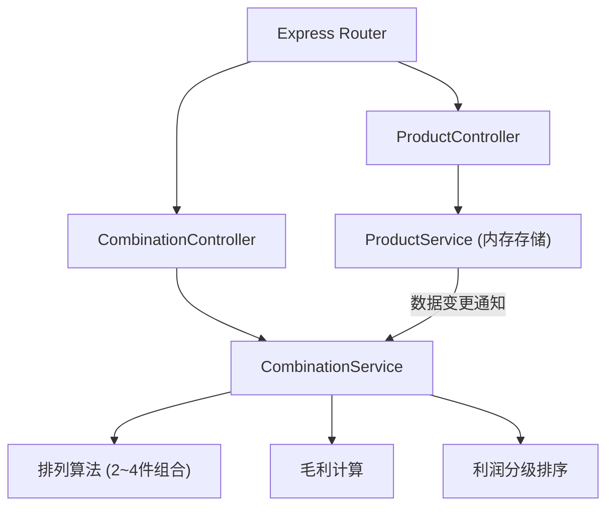
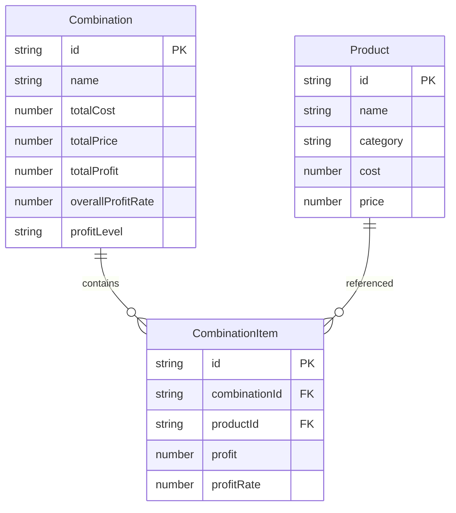

## 1. 架构设计



## 2. 技术说明

- 前端：React@18 + TypeScript + TailwindCSS@3 + Vite
- 初始化工具：vite-init（react-express-ts 模板）
- 后端：Express@4 + TypeScript（ESM 格式）
- 数据库：无数据库，使用内存数据结构存储成品与组合数据
- 状态管理：Zustand
- HTTP 客户端：Axios
- 图标库：lucide-react

## 3. 路由定义

| 路由 | 用途 |
|------|------|
| / | 主页面，包含成品参数配置与组合收益推演 |

## 4. API 定义

### 4.1 成品管理

```typescript
interface Product {
  id: string;
  name: string;
  category: "pottery" | "aromatherapy" | "plaster" | "leather" | "candle" | "other";
  cost: number;
  price: number;
}

// GET /api/products - 获取所有成品
// Response: { products: Product[] }

// POST /api/products - 新增成品
// Request: Omit<Product, "id">
// Response: { product: Product }

// PUT /api/products/:id - 更新成品
// Request: Partial<Omit<Product, "id">>
// Response: { product: Product }

// DELETE /api/products/:id - 删除成品
// Response: { success: boolean }
```

### 4.2 组合推演

```typescript
interface CombinationItem {
  productId: string;
  productName: string;
  category: string;
  cost: number;
  price: number;
  profit: number;
  profitRate: number;
}

interface Combination {
  id: string;
  name: string;
  items: CombinationItem[];
  totalCost: number;
  totalPrice: number;
  totalProfit: number;
  overallProfitRate: number;
  profitLevel: "high" | "medium" | "low";
}

// GET /api/combinations - 获取所有组合方案
// Response: { combinations: Combination[] }
```

### 4.3 实时重算触发

```typescript
// POST /api/combinations/recalculate - 触发全量重算
// Response: { combinations: Combination[] }
```

## 5. 服务端架构图



## 6. 数据模型

### 6.1 数据模型定义



### 6.2 数据定义

本工具使用内存数据结构，无需数据库 DDL。初始化时预置 6 款示范成品数据：

| 名称 | 分类 | 成本(元) | 售价(元) |
|------|------|----------|----------|
| 陶艺花瓶 | pottery | 18 | 58 |
| 香薰蜡烛 | aromatherapy | 12 | 45 |
| 石膏娃娃 | plaster | 8 | 35 |
| 手工皮夹 | leather | 25 | 78 |
| 果冻蜡杯 | candle | 10 | 38 |
| 陶艺茶杯 | pottery | 15 | 48 |
